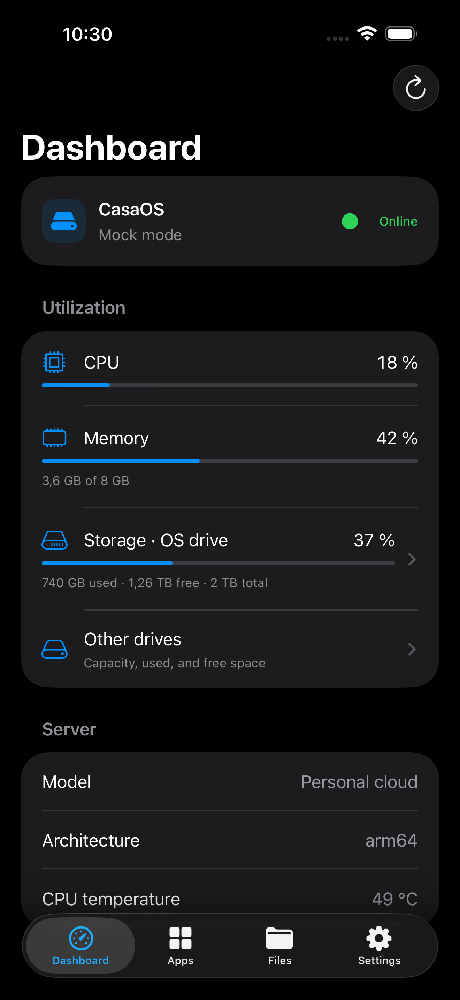
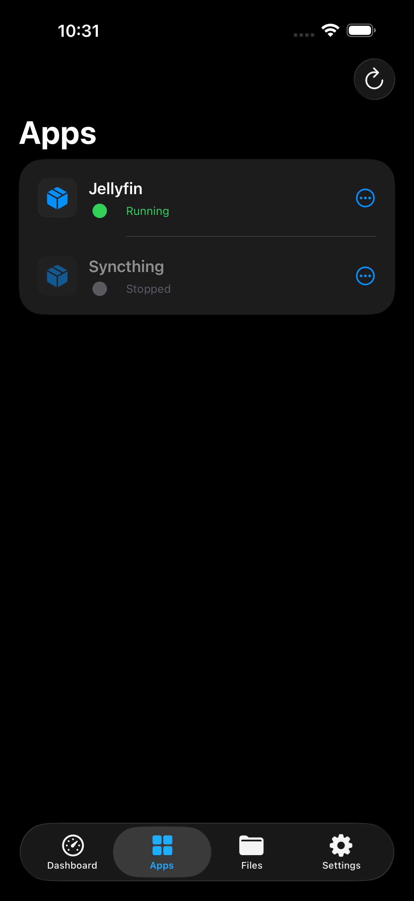
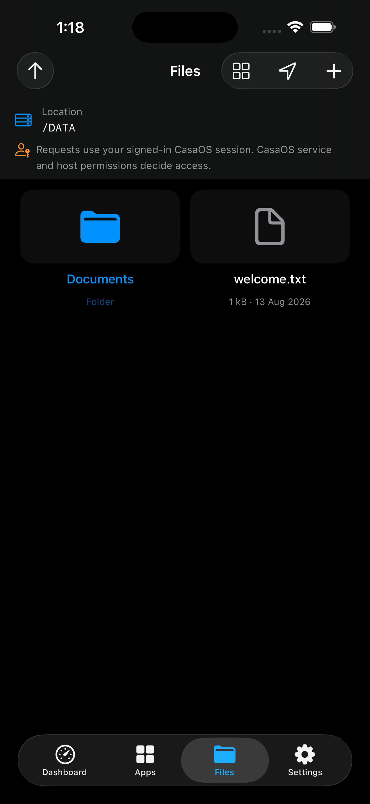
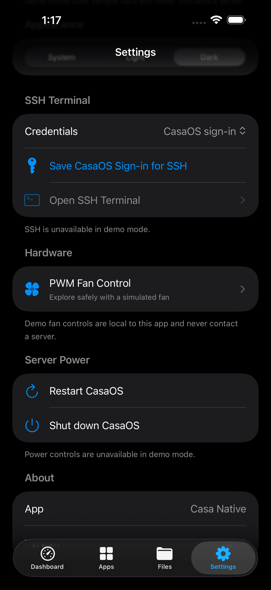
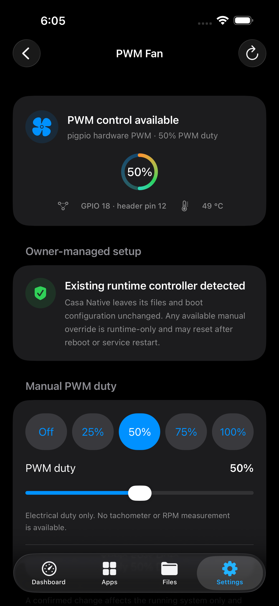

# Casa Native

Casa Native is a lightweight, native SwiftUI client for managing a personal CasaOS server from an iPhone. It targets iOS 26 and later.

> [!IMPORTANT]
> Casa Native is an unofficial community project. It is not affiliated with, endorsed by, sponsored by, or supported by IceWhale Technology Ltd. (IceWhaleTech). CasaOS and related names, logos, and marks belong to their respective owners.

The project is under active development. Read [Security](#security), [API behavior and limitations](#api-behavior-and-limitations), and [Licensing](#licensing) before connecting it to an important server.

## Screenshots

These screenshots use Casa Native's built-in mock mode. They contain no live hostname, account, token, drive serial number, or other server data.

| Dashboard | Apps |
| --- | --- |
|  |  |

| Files | Settings |
| --- | --- |
|  |  |

| PWM fan control |
| --- |
|  |

## Features

### Connection and session management

- Tries a saved endpoint, `casaos.local`, and advertised `_casaos._tcp`, HTTP, and HTTPS Bonjour services.
- Verifies every discovered endpoint with the CasaOS API; generic web servers are ignored.
- Accepts manual LAN hostnames, `.local` names, IP addresses, full HTTP(S) URLs, and Tailscale MagicDNS names.
- Signs in through CasaOS and stores access and refresh tokens in the device-only Keychain.
- Validates restored sessions at launch, refreshes an expired access token once, and removes an invalid session.
- Includes a self-contained mock mode for offline exploration and sanitized screenshots.

Stock CasaOS does not advertise `_casaos._tcp` through Bonjour. Exact automatic discovery requires an optional Avahi advertisement configured by the server owner. Casa Native never installs or changes that server configuration, and it does not scan the local subnet.

### Dashboard and storage

- Shows CPU, memory, system storage, CPU temperature, hardware model, architecture, and CasaOS version. Stock CasaOS 0.4.15 does not expose CPU frequency, so Casa Native does not estimate or invent it.
- Soft-refreshes utilization every 10 seconds only while the dashboard and app are active. Static server metadata is cached.
- Shows non-system drives from CasaOS storage data, including standalone drives and inferred multi-drive filesystem clusters.
- Opens the OS-storage row into its backing physical drive or cluster, using CasaOS's system-storage view on demand.
- Drills from a cluster into its physical member paths.
- Loads CasaOS-reported drive health, temperature, model, serial number, type, capacity, and path only after an individual drive is opened.
- Performs one drive-health request on entry and only explicit manual refreshes afterward. Cluster and Other Drives screens do not request SMART data.
- Offers a separate, manual **Check via SSH (Standby-Safe)** action on every individual physical-drive screen, including OS drives and RAID members. It uses `smartctl -a -j -n standby` for that exact `/dev` path, never runs from a drive list or cluster screen, and never polls.
- If the selected drive is awake, the standby-safe action shows the available structured SMART result immediately. If it is sleeping or its power state cannot be confirmed, Casa Native does not wake it; a separate **Wake & Read SMART** action requires an on-screen confirmation naming the drive and device path and warning about spin-up.
- Prioritizes overall SMART pass/fail, temperature, explicitly reported life or wear percentages, power-on hours and cycles, sector and CRC errors, NVMe health fields, and drive identity/protocol. Missing values remain unavailable; Casa Native does not derive a health percentage.

### Apps, files, and server controls

- Lists installed Compose apps, shows status, and provides start, stop, and restart controls.
- Opens a running app in an in-app browser using the active LAN or Tailscale host.
- Starts Files at `/DATA`, supports navigation across the server filesystem, and opens authenticated downloads in native Quick Look.
- Allows folder creation, upload, rename, copy, move, and guarded deletion at any safe absolute server path permitted by the CasaOS service and host; explicit downloads do not modify the server.
- Supports multi-file selection for uploads, shows per-file progress and a completion summary, and continues past individual file failures.
- Offers List and Grid layouts and remembers the selected layout on the iPhone. Grid lazily renders aspect-preserving native thumbnails in square preview wells for supported files up to 16 MiB, letterboxing when needed instead of cropping; larger, unknown, or unsupported files retain their type icon and remain available through explicit Quick Look preview.
- Uses CasaOS's non-overwriting copy/move mode by default. Accepted transfers are shown as queued because CasaOS performs them asynchronously.
- **Filesystem warning:** Casa Native is not a filesystem sandbox and adds no `/DATA` mutation boundary. Requests use the signed-in CasaOS session, but stock file handlers run with CasaOS daemon privileges rather than a documented per-account filesystem ACL. A privileged backend may alter or permanently delete operating-system and application files. Review every path and destructive confirmation carefully.
- Confirms CasaOS restart and shutdown operations before sending them.
- Supports System, Light, and Dark appearance modes.

### SSH terminal

- Provides a native, ephemeral SSH terminal built with SwiftTerm and SwiftNIO SSH.
- Defaults fresh installations to reusing the successful CasaOS sign-in for SSH, with a separate Linux SSH sign-in still available in Settings.
- Shows a SHA-256 host-key fingerprint on first use, pins the accepted key, and blocks changed keys.
- Tears down the connection and clears terminal state when the terminal closes, loses focus, or the app backgrounds.

### Raspberry Pi PWM fan control

- Detects supported fan controllers over a bounded, host-key-pinned SSH session before offering a write. Detection does not export PWM, change GPIO state, edit boot configuration, restart a service, or install anything.
- Distinguishes owner-managed pigpio, Linux PWM sysfs, and `gpio-fan` setups from Casa Native-managed configurations. External `gpio-fan` policies are displayed read-only; their files and boot settings remain under the server owner's control.
- Shows the verified GPIO and physical header pin, backend, electrical PWM duty and frequency when available, automatic off/full demand, and current CasaOS CPU temperature for context. It never labels duty as measured speed and makes no RPM or physical-motion claim.
- Offers app-managed **Manual** control at a fixed 25 kHz period with 0–100% duty in five-percent steps, including Off, 25%, 50%, 75%, and 100% presets.
- Offers app-managed **Automatic** kernel `gpio-fan` control with a 40–75 °C turn-on threshold and 5–15 °C hysteresis, both adjustable in one-degree steps. The UI shows the computed turn-off threshold. This is an off/full kernel policy, not a variable-speed app curve or background polling loop.
- Requires wiring and GPIO-resource acknowledgements before fresh setup. Automatic setup additionally requires confirmation that the control interface is GPIO-safe and active-high (low is off, high is full), that a 3-wire fan's third lead is tachometer output rather than speed control, and that a 4-wire PWM input uses a level-safe, open-drain interface. GPIO 12, 13, 18, and 19 are the only supported outputs, and each picker label includes its physical 40-pin-header position.
- Stages every managed setup, mode, policy, pin, rollback, and uninstall change. Same-pin mode or temperature-policy changes wait for a manual reboot. Pin changes wait for a full shutdown, disconnected power, an explicit wire-move checklist, a boot, and a final keep-or-rollback decision. Casa Native never reboots or shuts down the server by itself.
- Recognizes only the exact supported legacy `fan50` layout for conversion. Conversion preserves current output and keeps the original files as a backup until the user explicitly restores or discards them; similar or ambiguous owner-managed files are not rewritten.
- Keeps compatible owner-managed pigpio/sysfs duty changes runtime-only. They may reset after reboot or service restart. A separately confirmed action can relinquish a pigpio override to a verified owner-managed `gpio-fan` controller.
- Quarantines further mutations after an interrupted or unverifiable write, then re-detects before controls become available again.

Casa Native does not install server packages. Required Raspberry Pi kernel interfaces and command-line tools must already exist, and the SSH account must have the needed permission. Hardware PWM can conflict with analog audio or I²S resources. Wiring, transistor/MOSFET selection, flyback protection where appropriate, grounding, power supply, and fan electrical limits remain the server owner's responsibility.

## Requirements

- macOS with Xcode 26.6 or a compatible newer Xcode release
- iPhone running iOS 26 or later, or an iOS 26 simulator
- A reachable CasaOS server for live mode
- A reachable SSH service and saved credentials from either CasaOS sign-in reuse or Separate sign-in for Terminal, detailed SMART, and PWM fan control; direct SMART and privileged fan operations require a Linux account allowed to use `sudo`
- `smartctl` from smartmontools already installed on the server for detailed SMART. Casa Native does not install it.
- Network access during initial Swift package resolution

The committed Xcode SwiftPM lockfile pins SwiftTerm 1.18.0, SwiftNIO SSH 0.15.0, SwiftNIO 2.101.3, Swift Crypto 4.5.1, and their resolved transitive dependencies. Builds and CI use the committed `Package.resolved` rather than selecting newer package versions automatically.

## Architecture

Casa Native keeps UI, session state, transport, and credentials separated:

```text
SwiftUI views
  AppModel (connection and app-wide state)
    CasaOSClient protocol
      HTTPCasaOSClient actor (live CasaOS HTTP API)
      MockCasaOSClient actor (offline fixtures)
    Keychain-backed token and SSH credential stores
    BonjourDiscovery
    SwiftNIO SSH session and host-key store
    SMART drive controller (explicit standby-safe preflight and confirmed wake)
    PWM fan controller (bounded read-only detection, confirmed runtime writes,
      and a managed two-phase configuration lifecycle)
```

`URLSession` uses ephemeral configurations for CasaOS probing and API traffic. The HTTP client is an actor, which serializes token and metadata state. UI code depends on the `CasaOSClient` protocol, allowing contract tests to use deterministic URL fixtures and views to use mock data without contacting a server.

## API behavior and limitations

Casa Native consumes stock CasaOS v1 and v2 HTTP endpoints. The important boundaries are intentional:

- `/v1/users/status` verifies a candidate before the app treats it as CasaOS.
- CasaOS login and refresh endpoints provide the session tokens used in the raw `Authorization` header expected by CasaOS.
- System version, hardware, and utilization endpoints populate the dashboard. Only utilization is polled. CasaOS 0.4.15 reports CPU use, core count, temperature, power telemetry, and model, but not CPU frequency; the app therefore cannot show a trustworthy frequency value.
- Authenticated `GET /v1/storage` supplies mounted parent disks and children for Other Drives. The OS-drive drilldown requests the same endpoint with `system=true`, as required by stock CasaOS. Multi-drive clusters are inferred from shared logical filesystem metadata because this response does not report RAID level, array state, rebuild progress, or redundancy health.
- Authenticated `GET /v1/disks` supplies `name`, `size`, `model`, `health`, `temperature`, `disk_type`, `serial`, and `path`. Casa Native calls it only from an individual-drive detail screen. CasaOS may itself use standby-friendly SMART handling and a roughly 24-hour server-side cache.
- Stock CasaOS does not expose a full SMART-attribute endpoint. Casa Native therefore does not invent power-on hours, sector counts, wear, or other attributes. It says **Reported healthy** only when CasaOS reports that state, and treats zero or missing temperature as unavailable.
- CasaOS 0.4.15 can omit USB-backed drives from `/v1/disks` even though `/v1/storage` lists them. For those devices, Casa Native keeps the storage name, capacity, and physical path visible and explicitly reports SMART as unavailable instead of showing an empty detail screen. Some CasaOS versions also return a default healthy state when detailed SMART data is missing, so the UI labels this as CasaOS-reported information rather than an independent diagnosis.
- Detailed SMART is a separate, explicit SSH path and does not replace the one-time CasaOS request. Its first action runs `smartctl -a -j -n standby` against one validated physical `/dev` path. An awake drive can return metrics without another action. A sleeping or unknown-state drive is not read until the user confirms **Wake & Read SMART** for that exact name and path. No direct SMART action runs on entry, during dashboard refresh, from Other Drives, or from a RAID cluster screen.
- Direct SMART uses the saved SSH credential mode, pinned host-key flow, bounded output, and `sudo` when required. It starts no SMART self-test and changes no drive settings. USB bridges decide whether SMART passthrough works; when smartctl requires an explicit `-d` device type, Casa Native reports that requirement and does not guess a bridge type.
- File taps download through the authenticated `/v1/file` endpoint into a uniquely named app-temporary folder, then open the local file in native Quick Look. Session tokens are not placed in preview URLs. Rename uses the matching file/folder name endpoint; copy and move use CasaOS's asynchronous batch-task endpoint with collision style `skip`.
- File-operation paths must be normalized absolute server paths without traversal or control characters. This validation prevents ambiguous requests; it does not restrict operations to `/DATA` or override CasaOS service and host permissions.
- CasaOS has no stock PWM fan-management API. Fan control therefore uses bounded SSH command sessions with the same saved credentials and pinned host identity as Terminal. Detection is read-only. Every mutation has its own confirmation, and an interrupted or unverifiable mutation disables further writes until the post-operation quarantine and re-detection finish.
- Compatible external pigpio and Linux PWM setups remain owner-managed. Any offered duty override is runtime-only. External `gpio-fan` is reported read-only; returning from a verified pigpio override relinquishes manual PWM without rewriting the automatic controller.
- Fresh managed setup uses server tools that are already installed. Manual mode uses a fixed 25 kHz PWM period and a validated GPIO mapping. Automatic mode uses the kernel `gpio-fan` off/full policy with validated on and hysteresis thresholds. Casa Native does not install packages, run a background thermal loop, measure RPM, or infer that a fan is physically moving.
- Managed changes use two-phase files and explicit recovery state. A same-pin mode/policy change requires a user-initiated reboot. A pin transition requires a full power-off and unpowered wire move. After the target boots, the user must finalize it or prepare rollback. Cancel is available only while a target is prepared but has not booted. Uninstall follows the same staged process, and no operation initiates reboot or shutdown.
- Only an exact verified legacy `fan50` setup can be converted. Its original files remain in a tracked backup until the user chooses exact restore or permanent discard. Ambiguous and other owner-managed configurations are never adopted or rewritten.
- Compose app actions, file mutations, and power endpoints are called only in response to the matching user action.

CasaOS API contracts can change between releases. The fixture-backed test suite detects known contract drift, but it cannot guarantee compatibility with every CasaOS version or third-party fork.

Third-party app interfaces such as Jellyfin remain their own web UIs. Casa Native currently excludes Zima cloud features, backup, VPN configuration, app installation/editing, disk formatting, Samba administration, variable-speed fan curves, RPM/tachometer monitoring, iPad-specific UI, localization, and App Store distribution.

File upload and explicit Save/Download are capped at 128 MiB because those paths currently buffer transfers in memory. Quick Look previews stream to app-temporary storage and are capped at 1 GiB. A preview must finish downloading before it opens.

## Security

CasaOS commonly serves plain HTTP. On an untrusted network, HTTP exposes credentials and session traffic to interception just as the stock web UI does. Prefer HTTPS, a trusted LAN, or a private Tailscale path. Casa Native does not bypass TLS certificate validation.

API tokens, CasaOS credentials optionally retained for SSH, separate SSH credentials, and pinned SSH host keys use Keychain items protected with `kSecAttrAccessibleWhenUnlockedThisDeviceOnly`. They are unavailable while the device is locked and do not migrate to another device through backup. This protection does not make extraction impossible from a compromised, jailbroken, or already-unlocked iPhone. Keep the device passcode-protected and updated.

**CasaOS sign-in** is the fresh-install default. After a successful CasaOS login, the same username and password are stored in a device-only Keychain item so SSH can reuse them; the Linux SSH account must accept those credentials. **Separate sign-in** remains available for servers that use different CasaOS and Linux credentials. Existing installations continue to honor their saved credential-mode preference. Changing modes does not delete credentials already saved in either entry; disconnecting and forgetting a server removes its session tokens and both SSH credential entries.

SSH never silently accepts a new server key. Confirm the first fingerprint out of band when possible. A changed key is blocked until the saved key is explicitly forgotten and a new fingerprint is confirmed. Terminal output and history are not persisted.

Direct SMART commands use the same host-key verification and saved SSH credential mode as Terminal. The standby-safe action includes smartctl's `-n standby` guard. Only the separate, confirmed wake action omits that guard, and its confirmation identifies one physical drive and warns that the read can spin it up. Neither action starts a SMART self-test, changes a drive setting, runs from a list or cluster screen, or polls. A required `sudo` password is sent only through SSH standard input and never placed in the command or diagnostics.

PWM fan commands use the same host-key verification and saved SSH credential mode as Terminal. A compatible pigpio runtime duty change uses the unprivileged `pigs` client and does not present the password to `sudo`. Confirmed setup, sysfs changes, and return-to-automatic actions first check whether passwordless `sudo` is available. If not, the saved SSH password may be supplied to `sudo` through standard input inside the encrypted SSH session. The password is never interpolated into a shell command or written to logs. Casa Native rejects a saved password containing line breaks for this use. Server-side sudo policy still decides whether the action is allowed.

Setting a fan to 0% can overheat hardware, while an incorrect GPIO choice or unsafe wiring can damage the Raspberry Pi, fan, or power supply. Review the selected GPIO, provide suitable switching hardware for the fan load, share ground correctly, and keep a recovery path before provisioning. Casa Native does not verify physical wiring or cooling adequacy.

Manually entered navigation and mutation paths reject traversal and control characters. Path validation is not a sandbox and Casa Native adds no `/DATA` mutation boundary: it can request changes anywhere in the server filesystem. Requests require a signed-in CasaOS session, while CasaOS service and host permissions determine what the backend can change. Because stock file handlers may run with privileged daemon rights, an accepted operation can damage the server or permanently delete system data. Verify paths before confirming an operation.

See [SECURITY.md](SECURITY.md) for vulnerability reporting, supported versions, and a fuller threat-boundary description.

### Tailscale note

Connect Tailscale before opening Casa Native. For plain HTTP, enter a short MagicDNS hostname such as `rpi`. A full `.ts.net` hostname must use valid HTTPS because App Transport Security does not classify that public suffix as a local-network name.

## Build from source

1. Clone the repository and open `CasaNative.xcodeproj` in Xcode 26.6.
2. Select the shared `CasaNative` scheme.
3. Choose an iPhone simulator or configure signing for a physical iPhone.
4. Build and run.
5. Enter a CasaOS hostname, IP address, or complete HTTP(S) URL, accept Local Network access, and sign in with the same account used by the CasaOS web UI.

Command-line simulator build:

```sh
xcodebuild \
  -project CasaNative.xcodeproj \
  -scheme CasaNative \
  -configuration Debug \
  -destination 'platform=iOS Simulator,name=iPhone 17 Pro Max,OS=26.5' \
  -derivedDataPath .build \
  -onlyUsePackageVersionsFromResolvedFile \
  CODE_SIGNING_ALLOWED=NO \
  build
```

If several Xcode versions are installed, select Xcode 26.6 first:

```sh
sudo xcode-select -s /Applications/Xcode_26.6.app/Contents/Developer
xcodebuild -version
```

## Test

Run **Product → Test** in Xcode, or use the same simulator configuration as CI:

```sh
xcodebuild \
  -project CasaNative.xcodeproj \
  -scheme CasaNative \
  -configuration Debug \
  -destination 'platform=iOS Simulator,name=iPhone 17 Pro Max,OS=26.5' \
  -derivedDataPath .testbuild \
  -resultBundlePath .testbuild/CasaNative.xcresult \
  -onlyUsePackageVersionsFromResolvedFile \
  -parallel-testing-enabled NO \
  CODE_SIGNING_ALLOWED=NO \
  test
```

Tests cover endpoint normalization, server probing, login and token refresh, authorization, dashboard polling and metadata caching, storage filtering and grouping, CasaOS drive-health summaries, fixture-backed direct-SMART command and JSON parsing, apps and actions, file preview and mutation contracts, file-path guards, recursive mock operations, Keychain abstractions, SSH credentials, identity and session behavior, and fixture-backed fan detection, validation, transitions, rollback, uninstall, recovery, and screen-model behavior.

Automated tests use fixtures and mock clients. They must not call a live server's `/v1/disks`, run live SSH or smartctl, wake a drive, change apps or files, or send power commands.

## Install on a physical iPhone

### Xcode

1. Connect the iPhone to the Mac and trust the computer if prompted.
2. Open `CasaNative.xcodeproj`, select the `CasaNative` target, and open **Signing & Capabilities**.
3. Select your own Apple development team. Change `com.aarikmudgal.CasaNative` to a bundle identifier unique to that team if Xcode requests it.
4. Select the connected iPhone as the run destination and press **Run**.
5. If iOS requests it, enable Developer Mode and approve the developer certificate/profile shown for your own account.

Apple's current guidance covers [running an app on a physical device](https://developer.apple.com/documentation/Xcode/running-your-app-on-simulated-or-physical-devices) and [enabling Developer Mode](https://developer.apple.com/documentation/Xcode/enabling-developer-mode-on-a-device).

### Sideloadly

Tagged releases may include `CasaNative-unsigned.ipa`. This artifact contains an unsigned Release build: it has no Apple signing identity or provisioning profile and is **not directly installable**. It must be re-signed for your device before iOS will accept it.

1. Download the IPA and its `.sha256` file from the same GitHub release.
2. Verify the download:

   ```sh
   shasum -a 256 -c CasaNative-unsigned.ipa.sha256
   ```

3. Download Sideloadly only from its [official website](https://sideloadly.io/) and assess the risks of giving any third-party signing tool access to your Apple account.
4. Connect the iPhone, drag the unsigned IPA into Sideloadly, enter your own free or paid Apple ID when prompted, and start the install. Sideloadly re-signs the app during this process.
5. Follow iOS prompts for Developer Mode and profile trust if required.

Free Apple development profiles normally expire after seven days, so the app must be re-signed and installed again. Paid account behavior follows Apple's current provisioning rules. Never use credentials supplied by a release author or another person.

## Releases and CI

Every pull request and each push to `main` runs three independent CI gates:

- Repository and release-metadata validation, including the release tool's unit tests.
- Unsigned tests on GitHub's `macos-26` runner with Xcode 26.6 and an iPhone 17 Pro Max simulator running iOS 26.5.
- Xcode static analysis against that same locked project and simulator configuration.

The Xcode jobs resolve only versions in the committed `Package.resolved`. A warning emitted from Casa Native or Casa Native test source is treated as a failure; warnings internal to a locked third-party package remain that package's responsibility. Failed Xcode jobs retain their `.xcresult` bundle for seven days. GitHub CodeQL remains a separate required release check.

After CI completes successfully for an in-repository push to `main`, the release workflow verifies that exact commit is still `origin/main`. It waits for every check run attached to that commit, requires the repository, simulator, static-analysis, and CodeQL checks, and refuses to release if any observed check is incomplete or has a failing terminal conclusion. GitHub's non-failing `success`, `neutral`, and `skipped` conclusions are accepted. If `main` advances during validation, the stale run stops and the newer CI run handles the combined changes.

Versioning follows Semantic Versioning across commits since the latest `vX.Y.Z` tag. A Conventional Commit with `!` or a `BREAKING CHANGE:` footer selects a major release, `feat:` selects a minor release, and other non-release commits select a patch release. The highest applicable bump wins. User-visible pull requests should add useful nuance under `[Unreleased]`. If that section is empty, the release tool keeps automation recoverable by generating a `Changed` list from sanitized non-release commit subjects. The workflow increments the positive build number independently.

For a planned release, the workflow promotes `[Unreleased]`, updates both Xcode version configurations, and then repeats repository validation, exact simulator tests, Xcode static analysis, and the unsigned device build. Only after all of those gates pass does it create a `chore(release): vX.Y.Z` commit authored and committed as `Aarik Mudgal <aarikmudgal@gmail.com>`, create an annotated tag, and atomically push `main` and the tag. It creates a draft GitHub release, uploads and verifies every asset, and publishes the release only after the draft is complete. The workflow packages:

- `CasaNative-unsigned.ipa`
- `CasaNative-unsigned.ipa.sha256`
- `LICENSE`
- `THIRD_PARTY_NOTICES.md`

The IPA also contains the project license and third-party notices. It contains no Apple certificate, provisioning profile, Apple ID, or Apple signing secret. Release IPAs must be re-signed as described above.

Automated publication requires the `RELEASE_TOKEN` Actions secret so every release push and GitHub Release is authenticated as `aarikmudgal`. Use a fine-grained personal access token limited to this repository with read/write **Contents** access. Before release preparation, the workflow requires the secret and verifies the authenticated account; it never falls back to a bot identity. Store the token only in GitHub Actions secrets, revoke it if it is exposed or no longer needed, and never place it in source, logs, pull requests, or artifacts.

The `main` ruleset grants the Repository Admin identity a bypass for the account-authenticated release commit and annotated tag. If that identity cannot update the protected branch, the atomic push stops safely and no release is published.

The Release workflow also has a manual recovery entry point. A blank recovery tag retries normal release planning for the checked current `main`. Supplying an existing canonical tag such as `v0.2.0` is only for an interrupted draft: the workflow requires the latest annotated release tag contained in `main`, refuses to alter an already-published release, and reruns metadata checks, simulator tests, static analysis, and the device build before replacing draft assets and publishing. Enable GitHub's immutable releases after confirming the workflow; its draft-first publication order is compatible with immutable assets and tags.

## Live-server validation policy

Project development may validate read-only requests against a personally controlled CasaOS server: connection, login, dashboard, storage, app listing/opening, and file listing/download. Automated validation never mutates a real server and never runs live SSH.

Any live direct-SMART investigation must be separately authorized by the server owner, name one physical device path, and begin with the standby-safe preflight. A wake read is a deliberate physical side effect because it can spin up a sleeping drive; perform it only after the owner accepts that effect. Never include a live SMART check or wake in automated validation.

Operations that change server state should be exercised only by the server owner with disposable data and acceptable downtime:

- Start, stop, or restart a disposable Compose app.
- Create, upload, download, and delete only disposable test items in a folder you intentionally prepared for validation; `/DATA` is the recommended location.
- Restart or shut down the server only when an outage is acceptable.
- Exercise fan writes or managed fan transitions only on owner-controlled hardware with verified wiring, adequate fallback cooling, acceptable downtime, and an out-of-band recovery path. Never make a live fan change as part of automated validation.
- Test Local Network permission denial and recovery on a physical iPhone.

## Contributing

Read [CONTRIBUTING.md](CONTRIBUTING.md) before opening a pull request. Security findings belong in the private process described in [SECURITY.md](SECURITY.md), not in a public issue.

## Licensing

Casa Native is open source under the [MIT License](LICENSE).

Bundled dependencies remain under their own licenses. See [THIRD_PARTY_NOTICES.md](THIRD_PARTY_NOTICES.md). Nothing in Casa Native's MIT License changes those third-party terms.

CasaOS and related names, logos, and marks are the property of their respective owners. Their descriptive use here does not imply affiliation or endorsement.
